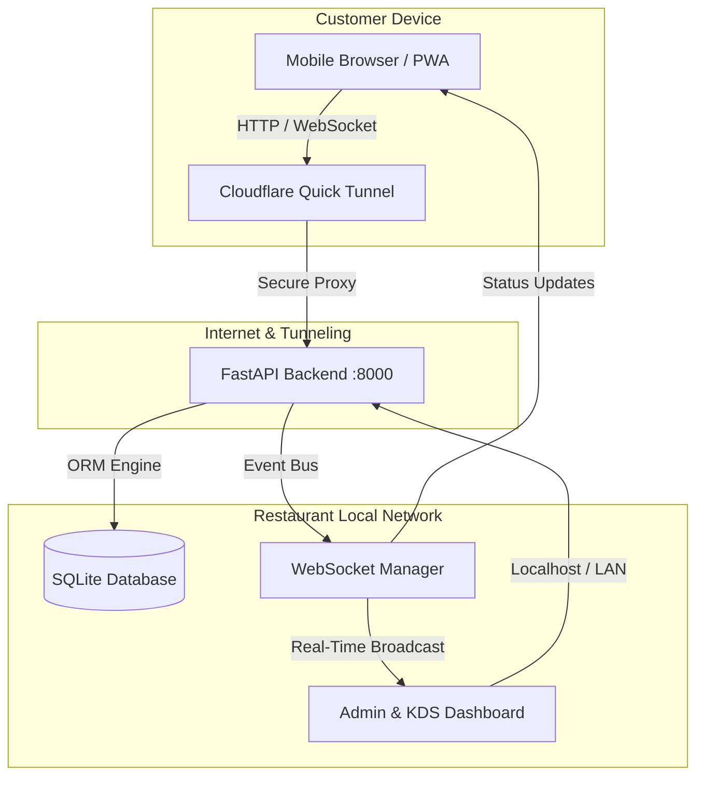

<div align="center">

# 🍽️ ServeFlow POS
### *Modern, Zero-Config, Offline-First Restaurant Point-of-Sale & QR Ordering System*

[](https://fastapi.tiangolo.com)
[](https://react.dev)
[](https://vitejs.dev)
[](https://www.sqlite.org)
[](https://developer.mozilla.org/en-US/docs/Web/API/WebSockets_API)
[](https://www.cloudflare.com)
[](https://pyinstaller.org)

<p align="center">
  <b>A production-grade, self-contained restaurant operating system.</b><br>
  Includes an intuitive Kitchen Display System (KDS), digital table-side QR ordering, automated billing & receipts, sales analytics, and automated public internet tunneling with zero router configuration.
</p>

[Key Features](#-key-features) • [System Architecture](#-system-architecture) • [Live Workflows](#-live-workflows) • [Zero-Config Deployment](#-zero-config-deployment) • [Development Setup](#-development-setup)

---

</div>

## 🌟 Key Features

### 🖥️ 1. Real-Time Kitchen Display System (KDS)
* **Kanban Workflow**: Live card progression through `Pending` ➔ `Preparing` ➔ `Ready` ➔ `Served`.
* **Sub-Second WebSocket Sync**: Kitchen screens immediately alert with sound and animation when a customer places an order.
* **Billing Safe-Lock**: Once served, orders remain billable in the cashier register and cannot be accidentally cleared by kitchen staff.

### 📱 2. Table-Side QR Customer Experience (PWA)
* **Zero App Installation**: Customers simply scan their table's dynamic QR code to access the dark-mode digital menu.
* **Public Internet Ready**: Bundled with an automated Cloudflare Tunnel—customers can order using mobile cellular data (4G/5G) or Wi-Fi without SSL/port forwarding headaches.
* **Session Resiliency**: Persistent cart state and automatic active-order tracking if the customer locks their phone or navigates away.

### 🧾 3. Cashier & Point of Sale (POS) Counter
* **Automated Calculations**: Dynamic GST / sales tax auto-computation with configurable restaurant tax percentages.
* **Flexible Discounts**: Apply percentage or flat-rate bill discounts with instant recalculation.
* **80mm Thermal Receipt Printing**: Clean, standardized receipt format with 1-click browser printing for thermal POS hardware.

### 📊 4. Manager Analytics & Live Dashboard
* **Real-Time Revenue Metrics**: Track daily sales, total orders, occupancy rates, and average ticket size.
* **Popular Items Breakdown**: Visual metrics identifying best-selling menu items and categories.
* **Complete Audit Trail**: Historical sales archive with full timestamp logs and itemized order breakdowns.

---

## 🏗️ System Architecture



---

## 🛠️ Tech Stack & Tooling

| Component | Technology | Description |
| :--- | :--- | :--- |
| **Backend Engine** | Python 3.12, FastAPI, Uvicorn | High-performance asynchronous REST and WebSocket API. |
| **Data & Storage** | SQLite, SQLAlchemy 2.0 | Zero-configuration, ACID-compliant local database. |
| **Admin SPA** | React 18, Vite, TanStack Query | Responsive desktop dashboard with dark-mode aesthetic. |
| **Customer PWA** | React 18, Lucide, HTML5 Canvas | Ultra-fast mobile customer ordering interface. |
| **Tunneling** | Cloudflare Quick Tunnels (`cloudflared`) | Embedded zero-config reverse proxy for public internet access. |
| **Distribution** | PyInstaller | Compiles entire full-stack application into a single Windows `.exe`. |

---

## 🚀 Zero-Config Deployment (Production)

ServeFlow is engineered to run on any standard Windows PC without installing Python, Node.js, or database servers.

### 1-Click Startup for Restaurants:
1. Open the `RestaurantPOS-Release/` folder.
2. Double-click **`RestaurantPOS.exe`**.
3. **That's it!** 
   - The database automatically self-seeds initial tables, menu categories, and dishes.
   - The Admin Panel launches automatically in the default browser at `http://localhost:8000/admin`.
   - The Cloudflare tunnel automatically configures public internet access for customer QR codes.

---

## 💻 Development & Building from Source

### Prerequisites:
- Python 3.10+
- Node.js 18+

### 1. Clone the Repository
```bash
git clone https://github.com/RishiVartak6/Bill.git
cd Bill
```

### 2. Install Dependencies
```bash
# Set up Python backend
cd backend
python -m venv venv
venv\Scripts\activate
pip install -r requirements.txt

# Set up Admin frontend
cd ../frontend-admin
npm install

# Set up Customer frontend
cd ../frontend-customer
npm install
```

### 3. Build Production Standalone `.exe`
To compile both frontends and package everything into the single executable:
```powershell
python build_release.py
```
The resulting executable will be created in `RestaurantPOS-Release/RestaurantPOS.exe`.

---

## 📂 Project Directory Structure

```
ServeFlow-POS/
├── backend/                    # FastAPI Backend & WebSocket Hub
│   ├── app/
│   │   ├── api/                # API Endpoints (Auth, Menu, Orders, Billing, Analytics)
│   │   ├── auth/               # JWT security and password hashing
│   │   ├── models/             # SQLAlchemy ORM models
│   │   ├── schemas/            # Pydantic data schemas
│   │   ├── websocket/          # Real-time WebSocket connection manager
│   │   ├── config.py           # Application environment configuration
│   │   ├── database.py         # SQLite engine session bindings
│   │   └── main.py             # FastAPI entrypoint & tunnel orchestrator
│   ├── cloudflared.exe         # Bundled Cloudflare tunnel binary
│   └── requirements.txt        # Python backend dependencies
├── frontend-admin/             # React + Vite Admin Panel & KDS
│   ├── src/
│   │   ├── pages/              # Dashboard, Orders, Billing, Menu, Tables, Settings
│   │   ├── services/           # Axios API clients & WebSocket subscribers
│   │   └── store/              # Zustand authentication state
│   └── package.json
├── frontend-customer/          # React Mobile Ordering PWA
│   ├── src/
│   │   ├── pages/              # MenuPage, CartPage, OrderStatusPage, BillPage
│   │   ├── hooks/              # Real-time order status hooks
│   │   └── store/              # Persistent cart storage
│   └── package.json
├── RestaurantPOS-Release/      # Compiled production distribution folder
├── build_release.py            # Automated production bundling & packaging pipeline
├── bundle_build.py             # Frontend assets builder & distributor
└── README.md                   # Project documentation
```

---

## 🔒 Security & Best Practices

- **Node-Safe Execution**: Static assets and public tunnel endpoints are separated from sensitive administrative billing actions.
- **Password Protection**: Passwords are encrypted with `bcrypt` salt algorithms.
- **Isolated Storage**: SQLite databases are maintained locally on the restaurant's premises, guaranteeing data privacy and continuous offline operations.

---

## 📄 License
This project is licensed under the MIT License — see the [LICENSE](LICENSE) file for details.
